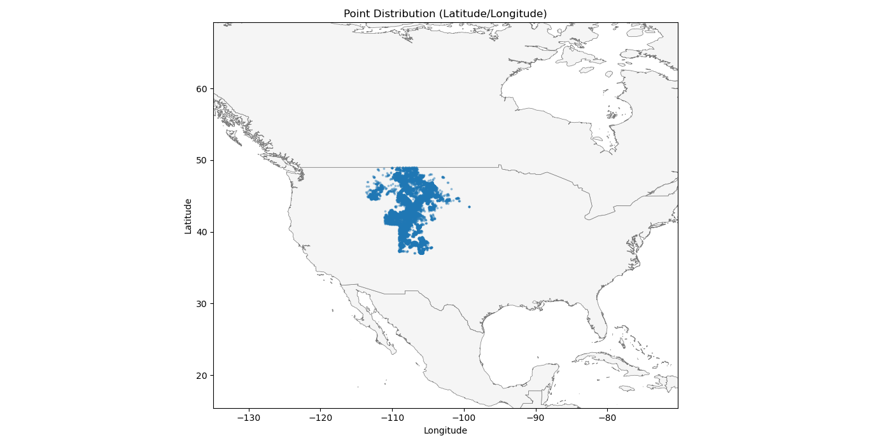

# GEE Satellite Embedding Tracer (NIH Grasslands Project)

*These are the point data scope of what we’re trying to model.*

This repository includes a small “tracer” script for the **NIH grasslands project** that demonstrates an end-to-end workflow:

1. Read point observations from a CSV (lat/lon + date + target fields)
2. Pull **Google Earth Engine (GEE)** *Satellite Embedding V1 (Annual)* vectors for each point-year
3. Cache the extracted embeddings locally (Parquet)
4. Train simple baseline regressions (Ridge) to predict target fields from embeddings
5. Write per-target models + metrics to disk

The goal is sanity checking that the embeddings provide measurable signal, not producing a final production model.

---

## What this is (and is not)

**This is:**
- A reproducible example of authenticating to GEE via a service account
- A working implementation of sampling the annual embedding product at point locations
- A baseline regression trainer and metrics writer
- A caching strategy to avoid re-querying GEE on every run

**This is not:**
- A spatially robust modeling workflow (no spatial holdouts / leakage controls)
- A daily embedding pipeline (the embedding product used here is annual)
- A tuned or production-quality ML model

---
